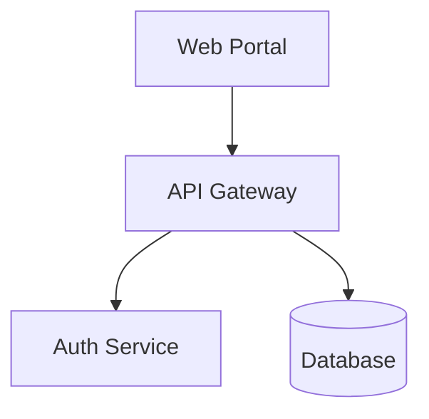
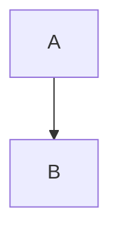
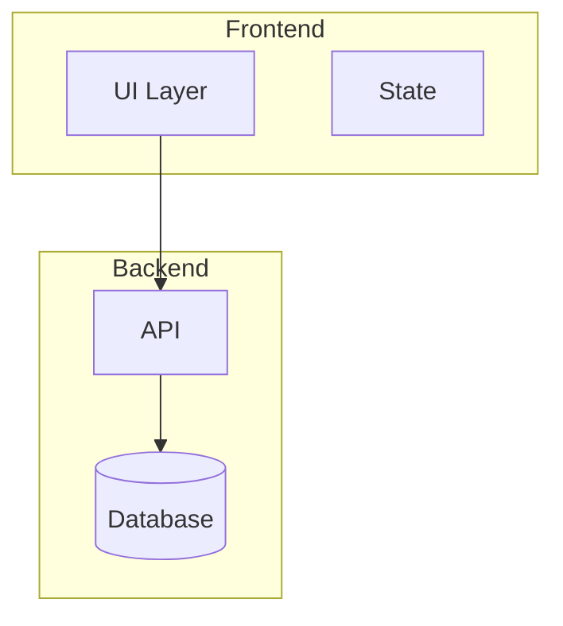
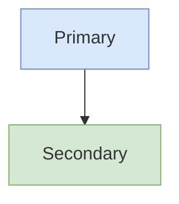

# Mermaid Diagrams

Apply this skill when creating architecture diagrams, flowcharts, sequence diagrams, or any visual documentation.

## File Formats

| Format | Extension | When to Use |
|--------|-----------|-------------|
| Standalone | `.mmd` | Dedicated diagram files, version control |
| Embedded | `.md` | Documentation with inline diagrams |

### .mmd Files (Preferred for diagrams)

Pure Mermaid syntax, no code fences:

```
flowchart TD
    A --> B
```

### .md Files (For documentation)

Mermaid wrapped in code blocks:

```markdown
​```mermaid
flowchart TD
    A --> B
​```
```

## Naming Convention

| ❌ Poor | ✅ Better |
|---------|----------|
| `A[Web Portal]` | `PORTAL[Web Portal]` |
| `B[API Gateway]` | `GATEWAY[API Gateway]` |
| `C[Database]` | `DB[Database]` |

**Use self-explanatory identifiers.** Short, uppercase IDs improve readability when defining relationships.

## Structure Pattern

**Declare nodes first, then define relationships:**



This separates structure from flow logic and improves maintainability.

## Comments



**Warning:** Avoid `{}` in comments — can break the renderer.

## Layout Direction

| Directive | Direction |
|-----------|-----------|
| `flowchart TD` | Top → Down |
| `flowchart LR` | Left → Right |
| `flowchart BT` | Bottom → Top |
| `flowchart RL` | Right → Left |

## Node Shapes

| Shape | Syntax | Use For |
|-------|--------|---------|
| Rectangle | `[text]` | Processes, actions |
| Rounded | `(text)` | Start/end points |
| Stadium | `([text])` | Events, triggers |
| Diamond | `{text}` | Decisions |
| Hexagon | `{{text}}` | Conditions, preparation |
| Cylinder | `[(text)]` | Databases, storage |
| Circle | `((text))` | Connections, junctions |

## Arrow Types

| Arrow | Syntax | Meaning |
|-------|--------|---------|
| Solid | `-->` | Direct flow |
| Dotted | `-.->` | Optional/async |
| Thick | `==>` | Primary path |
| With label | `-->\|label\|` | Described connection |
| Bidirectional | `<-->` | Two-way |

## Subgraphs

Group related nodes into logical sections:



## Styling

Apply styles after diagram definition:



### Standard Color Palette

| Purpose | Fill | Stroke |
|---------|------|--------|
| Primary/Frontend | `#dae8fc` | `#6c8ebf` |
| Success/Backend | `#d5e8d4` | `#82b366` |
| Warning/Auth | `#fff2cc` | `#d6b656` |
| Danger/Database | `#f8cecc` | `#b85450` |
| Purple/Cache | `#e1d5e7` | `#9673a6` |

## Layout Algorithms

For complex diagrams, use ELK renderer (Mermaid 9.4+):

```yaml
---
config:
  layout: elk
---
```

| Algorithm | Best For |
|-----------|----------|
| dagre (default) | Simple, balanced diagrams |
| elk | Large, complex diagrams |

## Common Pitfalls

| Issue | Solution |
|-------|----------|
| `end` keyword breaks flowchart | Wrap in quotes: `"end"` |
| Special characters break syntax | Escape or quote text |
| Nested shapes fail | Use quotes around content |
| Misspelled parameters | Silent failure — verify spelling |
| `{}` in comments | Avoid — breaks renderer |
| HTML tags like `<br/>` | Avoid — use separate nodes |

## Generation Checklist

Before delivering any Mermaid diagram:

- [ ] Correct format: `.mmd` for standalone, `.md` for embedded
- [ ] `.mmd` files have NO code fences
- [ ] Self-explanatory node identifiers (not `A`, `B`, `C`)
- [ ] Nodes declared before relationships
- [ ] Subgraphs used for logical grouping
- [ ] No special characters or HTML tags in labels
- [ ] No `{}` in comments
- [ ] Styles use standard color palette
- [ ] Tested in preview without errors

## Sources

- [Mermaid Syntax Reference](https://mermaid.js.org/intro/syntax-reference.html)
- [Mermaid Flowchart Tips](https://www.kallemarjokorpi.fi/blog/mastering-diagramming-as-code-essential-mermaid-flowchart-tips-and-tricks-2/)
