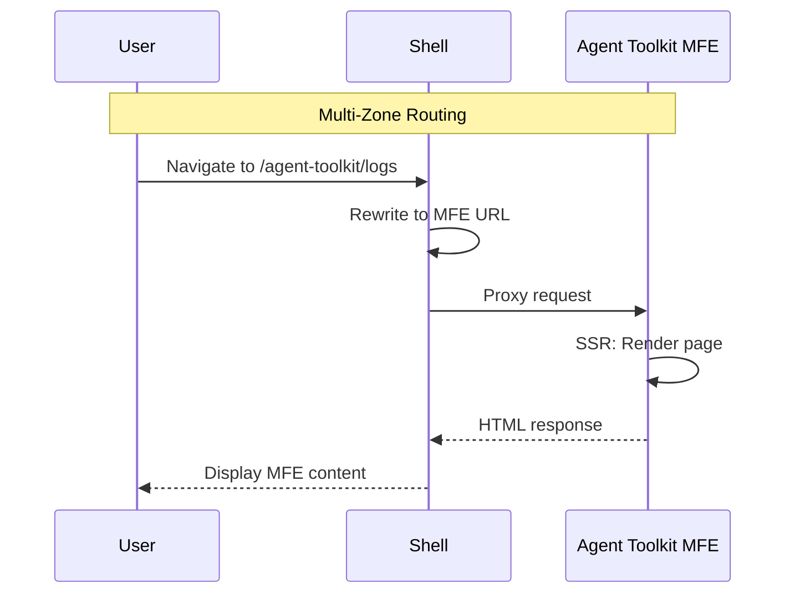

# StackOne Log Dashboard

Turborepo monorepo for the StackOne log dashboard platform with Multi-Zone MFE architecture.

## Contents

- [Architecture](#architecture)
- [Project Structure](#project-structure)
- [Quick Start](#quick-start)
- [Apps](#apps)
  - [Shell](#shell-appsshell)
  - [Agent Toolkit MFE](#agent-toolkit-mfe)
  - [Component Library MFE](#component-library-mfe)
  - [Design Review MFE](#design-review-mfe)
- [Packages](#packages)
  - [UI Library Core](#ui-library-core-packagesui-librarycore)
  - [Harness](#harness-packagesui-libraryharness)
  - [i18n](#i18n-packagesi18n)
- [Multi-Zone Architecture](#multi-zone-architecture)
- [Design System](#design-system)
- [Tech Stack](#tech-stack)
- [VSCode Tasks](#vscode-tasks)
- [Performance](#performance)
- [Developer Tooling](#developer-tooling)

---

## Architecture

Multi-Zone MFE architecture with 4 separate Vercel deployments.

### Deployment URLs

| App | URL | basePath |
|-----|-----|----------|
| Shell | `stackone-shell.vercel.app` | none |
| Agent Toolkit | `stackone-agent-toolkit.vercel.app` | `/agent-toolkit` |
| Component Library | `stackone-component-library.vercel.app` | `/component-library` |
| Design Review | `stackone-design-review.vercel.app` | `/design-review` |

### Application Flow



---

## Project Structure

```
apps/
  shell/                        → Next.js shell (port 3000)
  mfe/
    agent-toolkit/              → Agent Toolkit MFE (port 3001)
    component-library/          → Component Library MFE (port 3002)
    design-review/              → Design Review MFE (port 3003)
packages/
  ui-library/
    core/                       → @stackone-ui/core component library
    harness/                    → Vite dev preview tool (port 5173)
  i18n/                         → @stackone/i18n translations
  utils/                        → Shared utilities
docs/
  architecture.md               → Detailed architecture diagrams
.claude/                        → Developer tooling (rules, agents, recipes)
```

---

## Quick Start

```bash
pnpm install

# Development
pnpm dev                     # All apps in parallel
pnpm dev:shell               # Shell only (port 3000)
pnpm dev:agent-toolkit       # Agent Toolkit MFE (port 3001)
pnpm dev:harness             # Component Gallery (port 5173)

# Production build
pnpm build

# Deploy to Vercel
# See "Deploying" section below
```

---

## Apps

### Shell (`apps/shell`)

**Port:** 3000 | Main entry point with MFE routing

The shell serves the home page and proxies requests to MFEs via rewrites.

**Routes:**
- `/` - Home page with links to all MFEs
- `/agent-toolkit/*` - Rewrites to Agent Toolkit MFE
- `/component-library/*` - Rewrites to Component Library MFE
- `/design-review/*` - Rewrites to Design Review MFE

**Environment Variables:**
- `MFE_AGENT_TOOLKIT_URL` - Agent Toolkit MFE URL
- `MFE_COMPONENT_LIBRARY_URL` - Component Library MFE URL
- `MFE_DESIGN_REVIEW_URL` - Design Review MFE URL

### Agent Toolkit MFE

**Port:** 3001 | **basePath:** `/agent-toolkit`

Log viewing and analysis dashboard.

**Routes:**
- `/agent-toolkit/` - Redirects to logs
- `/agent-toolkit/logs` - Log list with virtualized table

**Features:**
- Virtualized table for 1000+ rows
- Stacked bar chart visualization
- Filter by status, time range, search query
- Log detail dialog

**Environment Variables:**
- `NEXT_PUBLIC_SHELL_URL` - Shell URL for home link

### Component Library MFE

**Port:** 3002 | **basePath:** `/component-library`

Showcases all 29+ components from `@stackone-ui/core`.

**Routes:**
- `/component-library/` - Gallery index
- `/component-library/[component]` - Individual component demo
- `/component-library/design-tokens` - Token documentation

**Environment Variables:**
- `NEXT_PUBLIC_SHELL_URL` - Shell URL for home link

### Design Review MFE

**Port:** 3003 | **basePath:** `/design-review`

Design assets and brand guidelines.

**Routes:**
- `/design-review/` - Design review page

**Environment Variables:**
- `NEXT_PUBLIC_SHELL_URL` - Shell URL for home link

---

## Packages

### UI Library Core (`packages/ui-library/core`)

Published as `@stackone-ui/core`. **Always use granular imports for tree-shaking:**

```tsx
// Components (granular paths)
import { Card, CardHeader } from '@stackone-ui/core/card'
import { Badge } from '@stackone-ui/core/badge'
import { Button } from '@stackone-ui/core/button'
import { Dialog } from '@stackone-ui/core/dialog'
import { Select } from '@stackone-ui/core/select'
import { Text } from '@stackone-ui/core/text'

// Config (server-safe)
import { ARIA, LABEL, SPRING, DURATION } from '@stackone-ui/core/config'

// Styles (server-safe)
import { Form, Layout, Interactive, Overlay } from '@stackone-ui/core/styles'

// Providers (client-only)
import { ThemeProvider } from '@stackone-ui/core/providers'
```

**29+ components:** Accordion, Alert, Avatar, Badge, Breadcrumb, Button, Card, Carousel, Checkbox, Collapsible, Dialog, Drawer, Input, Menu, NumberInput, Pagination, Paper, Popover, Progress, Radio, Select, Separator, Skeleton, Slider, Spinner, Switch, Table, Tabs, Text, Textarea, Toast, Tooltip

### Harness (`packages/ui-library/harness`)

**Port:** 5173 | Vite-powered component development gallery

- Hot module replacement (HMR)
- Live component testing
- Font showcase page
- Not published (internal tool)

### i18n (`packages/i18n`)

Centralized internationalization with typed keys.

```tsx
// Server Components
import { getTranslations, dashboard, logs, aria } from '@stackone/i18n'
const t = await getTranslations()
<h1>{t(dashboard.title)}</h1>
<input aria-label={t(aria.search)} />

// Client Components
import { useTranslations, labels } from '@stackone/i18n'
const t = useTranslations()
```

**Supported Languages:** English (en), French (fr)

---

## Multi-Zone Architecture

This project uses **Next.js Multi-Zones** with 4 separate deployments.

### Shell → MFE Navigation

Shell uses rewrites to proxy MFE routes:

```ts
// apps/shell/next.config.ts
async rewrites() {
  return [
    {
      source: '/agent-toolkit/:path*',
      destination: `${MFE_AGENT_TOOLKIT_URL}/agent-toolkit/:path*`,
    },
    // ... other MFEs
  ]
}
```

**Shell uses `<a>` tags for cross-zone navigation:**

```tsx
<a href={Routes.agentToolkit}>Agent Toolkit</a>
```

### MFE → Shell Navigation

MFEs use `NEXT_PUBLIC_SHELL_URL` environment variable:

```ts
// routes.ts
export const Routes = {
  shell: {
    home: process.env.NEXT_PUBLIC_SHELL_URL || '/',
  },
}

// Component
<a href={Routes.shell.home}>Back to Home</a>
```

### Vercel Environment Variables

**Shell (`stackone-shell`):**
- `MFE_AGENT_TOOLKIT_URL=https://stackone-agent-toolkit.vercel.app`
- `MFE_COMPONENT_LIBRARY_URL=https://stackone-component-library.vercel.app`
- `MFE_DESIGN_REVIEW_URL=https://stackone-design-review.vercel.app`

**Each MFE:**
- `NEXT_PUBLIC_SHELL_URL=https://stackone-shell.vercel.app`

---

## Deploying

Each app deploys from the monorepo root using Vercel CLI:

```bash
# Link and deploy shell
vercel link --project=stackone-shell
vercel --prod --yes

# Link and deploy agent-toolkit (temporarily modify vercel.json)
vercel link --project=stackone-agent-toolkit
# Update vercel.json buildCommand filter to @stackone/mfe-agent-toolkit
vercel --prod --yes

# Repeat for other MFEs...
```

**Root vercel.json:**
```json
{
  "framework": "nextjs",
  "installCommand": "pnpm install",
  "buildCommand": "pnpm turbo run build --filter=@stackone/shell",
  "outputDirectory": "apps/shell/.next"
}
```

---

## Design System

The UI library implements a **two-tier theming** system with namespace-based styling.

### Two-Tier Theming

| Tier | Contents | Loading |
|------|----------|---------|
| **Base** | Spacing, shadows, motion, radii | Bundled with app |
| **Brand** | Colors, typography | Fetched at runtime |

### Namespace Styling

All styles use centralized namespace objects (zero inline classnames):

```tsx
import { Form, Layout, Interactive, Overlay, Feedback } from '@stackone-ui/core/styles'

<label className={Form.Label.base}>Name</label>
<input className={Form.Input.base} />
<div className={Layout.Flex.center}>...</div>
<div className={Overlay.Card.container}>...</div>
<span className={Feedback.Badge.primary}>New</span>
```

### Typography

- **Sans-serif:** Figtree (weights: 400, 500, 600, 700)
- **Monospace:** IBM Plex Mono
- **CLS prevention:** Fallback fonts with metric adjustments

See [packages/ui-library/core/src/styles/README.md](packages/ui-library/core/src/styles/README.md) for full documentation.

---

## Tech Stack

| Category | Technology |
|----------|------------|
| **Build** | Turborepo 2.0+, pnpm 9.0.0 |
| **Apps** | Next.js 15, React 19, React Compiler |
| **Styling** | Tailwind CSS 3.4+, CSS variables |
| **Components** | Base UI, CSS animations, Motion (lazy) |
| **i18n** | next-intl |
| **Data** | REST, @tanstack/react-virtual, Recharts |
| **Testing** | Vitest, Playwright |
| **Icons** | Lucide React |

---

## VSCode Tasks

Available via **Terminal → Run Task** or `Cmd+Shift+P` → "Tasks: Run Task":

| Task | Description |
|------|-------------|
| `clean:ports` | Kill processes on ports 3000-3003, 5173 |
| `dev` | Launch all apps |
| `dev:shell` | Shell only (port 3000) |
| `dev:harness` | Component gallery (port 5173) |
| `build` | Production build all packages |
| `analyze:bundle` | Bundle size analysis |

---

## Performance

Optimized for minimal JavaScript and fast load times.

| Metric | Target | Current |
|--------|--------|---------|
| First Load JS | <110KB | 102KB |
| Lighthouse Performance | 90+ | 90 |
| Total Blocking Time | <200ms | 250ms |
| Unused JavaScript | <100KB | ~50KB |

### Key Optimizations

1. **Granular imports** - Never import from barrel `@stackone-ui/core`
2. **Server Components by default** - No `'use client'` unless required
3. **CSS-only animations** - Framer Motion lazy-loaded only when needed
4. **Modern browsers only** - No legacy polyfills

```bash
# Analyze bundle
cd apps/shell && ANALYZE=true pnpm build
```

See [performance.md](./performance.md) for the full optimization guide.

---

## Developer Tooling

The `.claude/` directory contains AI-assisted development tooling.

```
.claude/
├── CLAUDE.md               # Project rules and agent map (auto-loaded)
├── rules/                  # 15 coding standards
│   ├── code-standards.md   # Patterns, anti-patterns
│   ├── routing.md          # Route config, Multi-Zone navigation
│   ├── components.md       # Component architecture, styling
│   ├── accessibility.md    # ARIA, keyboard navigation
│   ├── i18n.md             # Translation patterns
│   ├── performance.md      # Optimization rules
│   ├── bundle.md           # Granular imports
│   ├── testing.md          # Test patterns
│   ├── security.md         # Input validation, XSS prevention
│   ├── git.md              # Commit conventions
│   └── ...
├── skills/                 # Reusable patterns
│   ├── styling.md          # Tailwind, Text component
│   └── react-patterns.md   # Hooks, context, memo
├── agents/                 # Automated validation
│   ├── pre-code-check      # Run BEFORE creating components
│   ├── component-auditor   # Run AFTER UI changes
│   ├── accessibility-auditor
│   ├── bundle-size-tracker
│   └── ...
└── component-recipes/      # 35 component templates
    ├── button.md
    ├── dialog.md
    ├── card.md
    └── ...
```

### Key Features

- **Rules** - Auto-triggered by keywords (e.g., "route" → routing.md)
- **Agents** - Pre-work validation, post-work audits
- **Recipes** - Copy-paste component patterns with best practices
