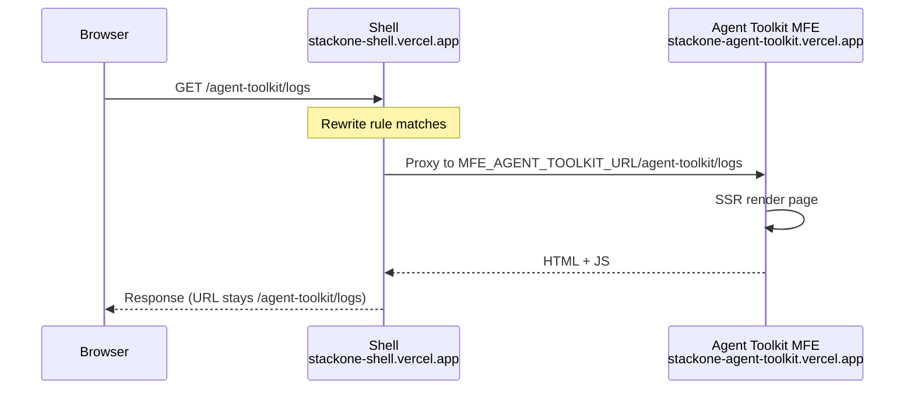
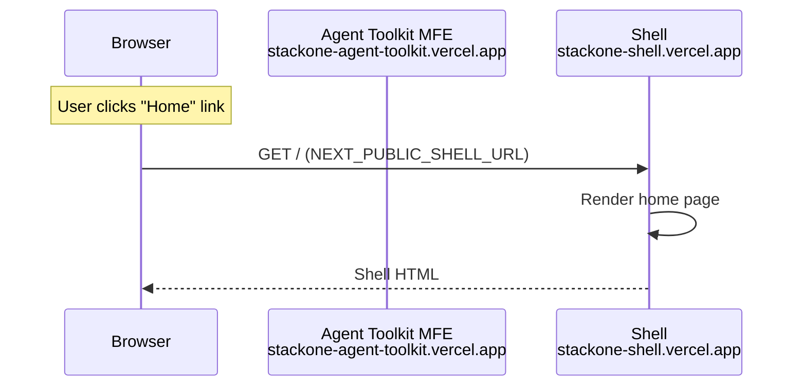

# StackOne Log Dashboard

A highly configurable log dashboard platform built on Multi-Zone MFE architecture. Designed for smooth UX with runtime-configurable theming, internationalization, component styling, and behavior settings - all without rebuilds.

## Quick Start

```bash
pnpm install
pnpm dev                     # All apps in parallel (ports 3000-3003)
pnpm dev:shell               # Shell only (port 3000)
pnpm dev:agent-toolkit       # Agent Toolkit MFE (port 3001)
pnpm dev:component-library   # Component Library MFE (port 3002)
pnpm dev:design-review       # Design Review MFE (port 3003)
pnpm dev:harness             # Component Gallery (port 5173)
pnpm build                   # Production build
pnpm clean                   # Remove turbo cache and node_modules
pnpm clean:ports             # Kill processes on ports 3000-3003, 5173
```

**VSCode:** Press `Cmd+Shift+B` (macOS) or `Ctrl+Shift+B` (Windows/Linux) to run tasks.

## Contents

- [Architecture](#architecture)
- [Project Structure](#project-structure)
- [Apps](#apps)
- [Packages](#packages)
- [Design System](#design-system)
- [Configuration](#configuration)
- [Tech Stack](#tech-stack)
- [Runtime Diagrams](#runtime-diagrams)

---

## Architecture

Multi-Zone MFE architecture with 4 separate Vercel deployments. Shell serves as the main entry point and proxies requests to independent MFE deployments via URL rewrites.

| App | URL | basePath | Port (dev) |
|-----|-----|----------|------------|
| Shell | `stackone-shell.vercel.app` | none | 3000 |
| Agent Toolkit | `stackone-agent-toolkit.vercel.app` | `/agent-toolkit` | 3001 |
| Component Library | `stackone-component-library.vercel.app` | `/component-library` | 3002 |
| Design Review | `stackone-design-review.vercel.app` | `/design-review` | 3003 |

---

## Project Structure

```
apps/
  shell/                        -> Next.js shell (port 3000)
  mfe/
    agent-toolkit/              -> Agent Toolkit MFE (port 3001)
    component-library/          -> Component Library MFE (port 3002)
    design-review/              -> Design Review MFE (port 3003)
packages/
  ui-library/
    core/                       -> @stackone-ui/core component library
    harness/                    -> Vite dev preview tool (port 5173)
  i18n/                         -> @stackone/i18n translations
  utils/                        -> @stackone/utils (logger, storage)
```

---

## Apps

### Shell (`apps/shell`)

Main entry point with MFE routing. Serves the home page and proxies requests to MFEs via rewrites.

**Routes:**
- `/` - Home page with links to all MFEs
- `/agent-toolkit/*` - Rewrites to Agent Toolkit MFE
- `/component-library/*` - Rewrites to Component Library MFE
- `/design-review/*` - Rewrites to Design Review MFE

### Agent Toolkit MFE (`apps/mfe/agent-toolkit`)

Log viewing and analysis dashboard.

**Routes:**
- `/agent-toolkit/logs` - Log list with virtualized table
- `/agent-toolkit/logs/[id]` - Log detail

**Features:**
- Virtualized table for 1000+ rows (@tanstack/react-virtual)
- Stacked bar chart visualization (Recharts)
- Filter by status, time range, search query

### Component Library MFE (`apps/mfe/component-library`)

Showcases components from `@stackone-ui/core`.

**Routes:**
- `/component-library/` - Gallery index
- `/component-library/[component]` - Individual component demo
- `/component-library/design-tokens` - Token documentation

### Design Review MFE (`apps/mfe/design-review`)

Design assets and brand guidelines.

---

## Packages

### UI Library Core (`packages/ui-library/core`)

Published as `@stackone-ui/core`. **Always use granular imports for tree-shaking:**

```tsx
// Components
import { Card, CardHeader } from '@stackone-ui/core/card'
import { Dialog } from '@stackone-ui/core/dialog'
import { Button } from '@stackone-ui/core/button'
import { Text } from '@stackone-ui/core/text'
import { Badge } from '@stackone-ui/core/badge'
import { Tag } from '@stackone-ui/core/tag'
import { Select } from '@stackone-ui/core/select'
import { Tabs } from '@stackone-ui/core/tabs'

// Styles (server-safe)
import { Form, Layout, Interactive, Overlay } from '@stackone-ui/core/styles'

// Config (server-safe)
import { ARIA, LABEL, SPRING, DURATION } from '@stackone-ui/core/config'

// Hooks (client-only)
import { useClickOutside, useEscapeKey } from '@stackone-ui/core/hooks'

// Providers (client-only)
import { ThemeProvider } from '@stackone-ui/core/providers'

// Fonts
import { fontLoader } from '@stackone-ui/core/fonts/next-loader'
```

#### Available Exports

| Export Path | Contents |
|-------------|----------|
| `./card` | Card, CardHeader, CardTitle, CardDescription, CardContent, CardFooter |
| `./dialog` | Dialog |
| `./drawer` | Drawer |
| `./paper` | Paper |
| `./text` | Text (h1-h6, body, caption, code variants) |
| `./button` | Button |
| `./input` | Input |
| `./search-input` | SearchInput |
| `./switch` | Switch |
| `./select` | Select |
| `./badge` | Badge |
| `./tag` | Tag |
| `./spinner` | Spinner |
| `./skeleton` | Skeleton |
| `./separator` | Separator |
| `./tabs` | Tabs |
| `./accordion` | Accordion |
| `./collapsible` | Collapsible |
| `./tooltip` | Tooltip |
| `./toast` | Toast |
| `./pagination` | Pagination |
| `./date-picker` | DatePicker |
| `./sidenav` | Sidenav |
| `./theme-switcher` | ThemeSwitcher |
| `./stacked-bar-chart` | StackedBarChart |
| `./scroll-area` | ScrollArea |
| `./display` | Badge, Tag, Spinner, Skeleton, Separator (barrel) |
| `./styles` | Form, Layout, Interactive, Overlay, Control, Feedback |
| `./hooks` | useClickOutside, useEscapeKey, useBodyScrollLock, etc. |
| `./config` | ARIA, LABEL, SPRING, DURATION, OFFSET |
| `./providers` | ThemeProvider |
| `./themes` | applyBaseTheme, validateBrandTheme |
| `./fonts` | Font utilities |
| `./fonts/next-loader` | Next.js font loader |
| `./fonts/css-loader` | CSS font loader |
| `./tailwind.preset` | Tailwind preset with CSS variables |

#### Shared Hooks

| Hook | Purpose |
|------|---------|
| `useControlledState` | Controlled/uncontrolled component state |
| `useBodyScrollLock` | Lock body scroll for modals/drawers |
| `useEscapeKey` | Dismiss on Escape key |
| `useClickOutside` | Close on outside click |
| `usePositioning` | Floating element positioning |
| `useFloatingPosition` | Advanced floating UI with arrow |
| `useMediaQuery` | Responsive breakpoints |
| `useIsMobile` / `useIsTablet` | Device detection |
| `useCopyToClipboard` | Copy to clipboard |
| `useBreakpoint` | Current breakpoint detection |

### Utils (`packages/utils`)

Published as `@stackone/utils`. Shared utilities used by other packages.

```tsx
import { createLogger } from '@stackone/utils'
import { createStorage } from '@stackone/utils'

const logger = createLogger('MyComponent')
logger.info('Component mounted')
```

### Harness (`packages/ui-library/harness`)

Vite-powered component development gallery (port 5173).

- Hot module replacement (HMR)
- Live component preview
- Dark/light theme toggle
- Playwright tests for accessibility

### i18n (`packages/i18n`)

Centralized internationalization with typed keys.

```tsx
// Server Components
import { getTranslations, dashboard, aria } from '@stackone/i18n'
const t = await getTranslations()
<h1>{t(dashboard.title)}</h1>
<input aria-label={t(aria.search)} />

// Client Components
import { useTranslations } from 'next-intl'
import { labels } from '@stackone/i18n'
const t = useTranslations()
```

**Supported Languages:** English (en), French (fr)

**Locale Detection:** Cookie-based with next-intl

---

## Design System

### Two-Tier Theming

| Tier | Contents | Loading |
|------|----------|---------|
| **Base** | Spacing, shadows, motion, radii, z-index | Bundled with app |
| **Brand** | Colors, typography | Fetched at runtime |

### Namespace Styling

All styles use centralized namespace objects (zero inline classnames):

```tsx
import { Form, Layout, Interactive, Overlay, Feedback } from '@stackone-ui/core/styles'

<label className={Form.Label.base}>Name</label>
<input className={Form.Input.base} />
<div className={Layout.Flex.center}>...</div>
<div className={Overlay.Card.container}>...</div>
<span className={Feedback.Badge.primary}>New</span>
```

### Typography

- **Sans-serif:** Figtree (weights: 400, 500, 600, 700)
- **Monospace:** IBM Plex Mono
- **CLS prevention:** Fallback fonts with metric adjustments

### Motion Configuration

```tsx
import { SPRING, DURATION, OFFSET } from '@stackone-ui/core/config'

// Spring presets
SPRING.default   // Standard spring
SPRING.bouncy    // More bounce
SPRING.snappy    // Quick, minimal overshoot
SPRING.tooltip   // For tooltips

// Duration (seconds)
DURATION.instant // 0.1
DURATION.fast    // 0.15
DURATION.normal  // 0.2
DURATION.slow    // 0.3
```

---

## Configuration

The system is designed for runtime configurability without rebuilds.

| Layer | Location | Hot-reload | Purpose |
|-------|----------|------------|---------|
| **Brand Theme** | `public/themes/*.json` | Yes | Colors, typography |
| **Base Theme** | `@stackone-ui/core/themes` | No (bundled) | Spacing, shadows, radii |
| **Translations** | `packages/i18n/messages/` | Yes | All user-facing text |
| **Runtime Config** | `public/config/*.json` | Yes | Feature behavior |
| **Component Styles** | `@stackone-ui/core/styles` | No (bundled) | Namespace patterns |

### Runtime Config Files

App behavior can be tuned via JSON config files without code changes:

**`public/config/latency.json`** - Latency visualization thresholds:
```json
{
  "thresholds": {
    "fast": { "max": 100, "color": "success" },
    "medium": { "max": 500, "color": "warning" },
    "slow": { "max": null, "color": "destructive" }
  },
  "display": { "segmentMs": 100, "maxSegments": 10 }
}
```

### Adding New Config Files

1. Add JSON to `public/config/`
2. Fetch at runtime: `fetch('/config/my-config.json')`
3. Validate with Zod schema
4. No rebuild required

---

## Tech Stack

| Category | Technology |
|----------|------------|
| **Build** | Turborepo 2.0+, pnpm 9.0.0 |
| **Apps** | Next.js 15, React 18/19, React Compiler (experimental) |
| **Styling** | Tailwind CSS 3.4+, CSS variables, @tailwindcss/container-queries |
| **Components** | @base-ui/react, Motion (lazy-loaded), Lenis (smooth scroll) |
| **i18n** | next-intl (cookie-based locale) |
| **Data** | @tanstack/react-virtual, Recharts |
| **Testing** | Playwright (harness, agent-toolkit) |
| **Icons** | Lucide React |

---

## Deploying

Each app deploys from the monorepo root. The `vercel.json` build command filter determines which app is built:

```json
{
  "framework": "nextjs",
  "installCommand": "pnpm install",
  "buildCommand": "pnpm turbo run build --filter=@stackone/shell",
  "outputDirectory": "apps/shell/.next"
}
```

To deploy a different app, change the `--filter` value:
- Shell: `--filter=@stackone/shell`
- Agent Toolkit: `--filter=@stackone/mfe-agent-toolkit`
- Component Library: `--filter=@stackone/mfe-component-library`
- Design Review: `--filter=@stackone/mfe-design-review`

---

## Performance

Optimized for minimal JavaScript and fast load times.

| Metric | Target |
|--------|--------|
| First Load JS | <110KB |
| Lighthouse Performance | 90+ |
| Total Blocking Time | <200ms |
| Cumulative Layout Shift | <0.1 |

### Key Optimizations

1. **Granular imports** - Never import from barrel `@stackone-ui/core`
2. **Server Components by default** - No `'use client'` unless required
3. **CSS-only animations** - Motion lazy-loaded only when needed
4. **Modern browsers only** - No legacy polyfills

```bash
# Analyze bundle
cd apps/shell && ANALYZE=true pnpm build
```

---

## Runtime Diagrams

### Initial Visit (Shell to MFE)



### Revisit (MFE back to Shell)



### Other Runtime Systems

**Two-Tier Theme Loading:** Base theme (spacing, shadows, radii) is bundled. Brand theme (colors, typography) is fetched at runtime from `/themes/*.json` - swap themes without rebuilds.

**i18n Key Resolution:** Cookie-based locale detection loads `messages/[locale]/*.json` at runtime. Add languages by dropping in new message files.

**Component Styling:** Zero-inline-classnames pattern with centralized namespace styles (`Form`, `Layout`, `Interactive`, `Overlay`, `Feedback`). Consistent, maintainable, and auditable.

**Runtime Config:** JSON files in `public/config/` control feature behavior (thresholds, display options). Change behavior without deployments.
