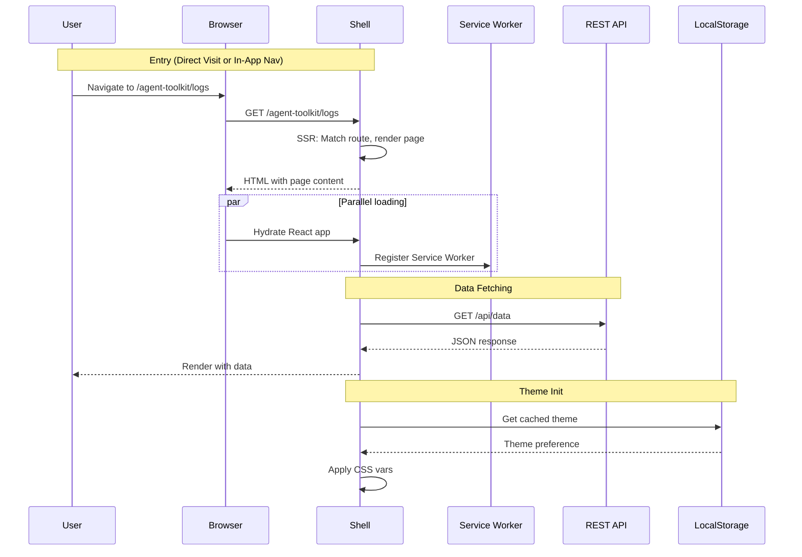
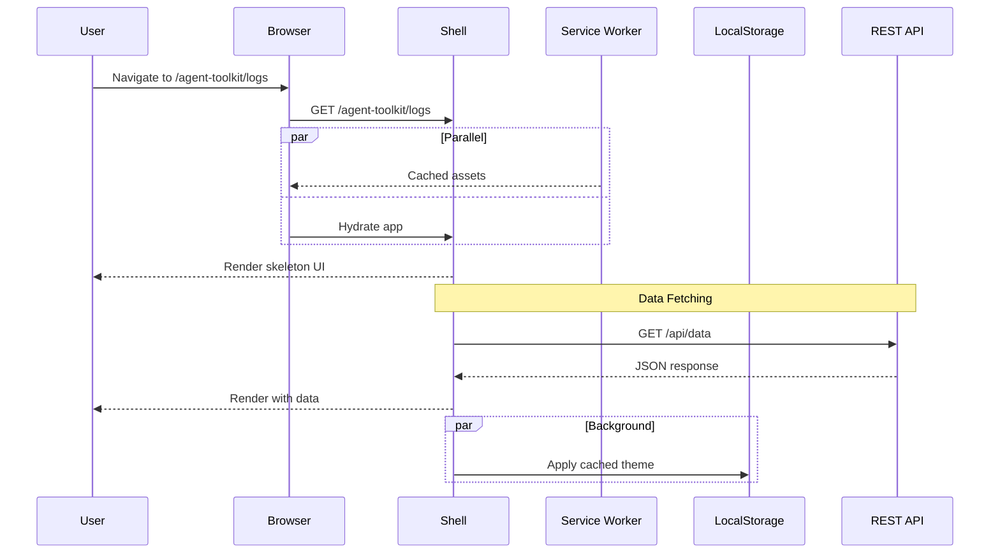
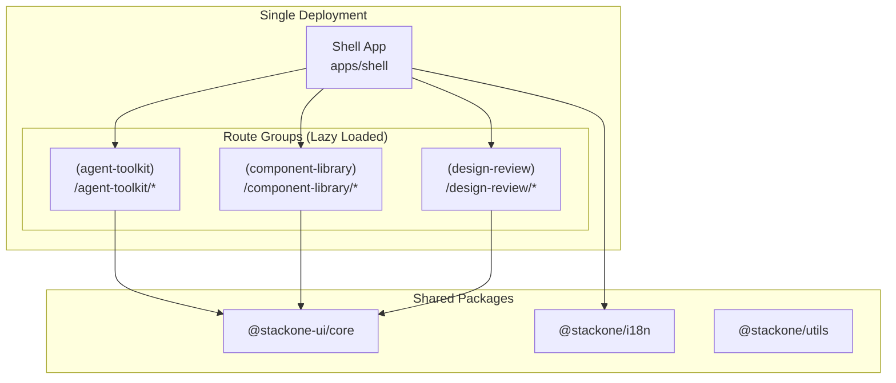
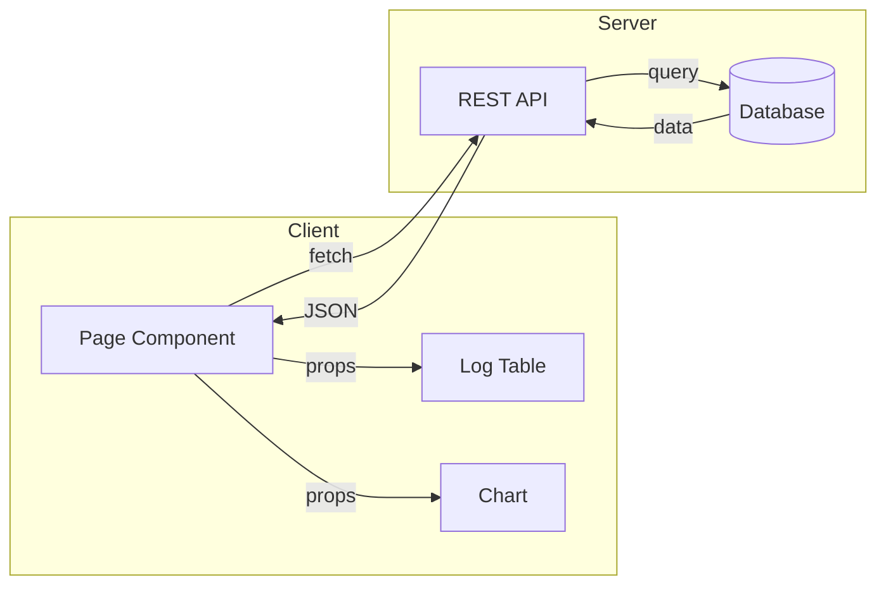
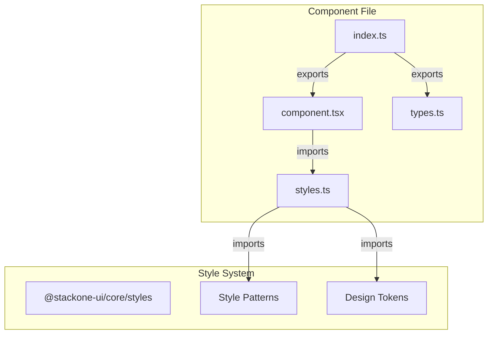
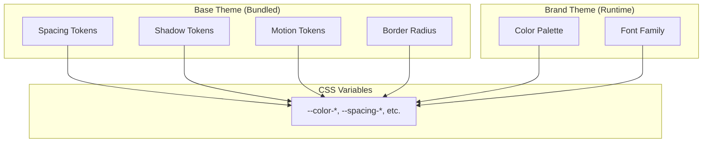

# Architecture

## Runtime

### First Visit Sequence

---

### Return Visit Sequence

---

## Application Structure

### Unified App with Lazy-Loaded Sections

---

## Data Flow

### REST-First Pattern

---

## Component Architecture

### Zero-Inline-Classnames Pattern

---

## Theming

### Two-Tier Theme System

