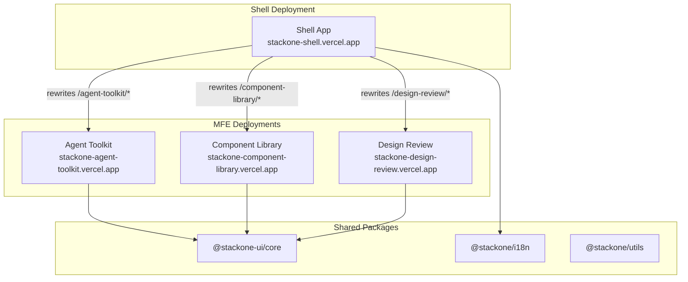
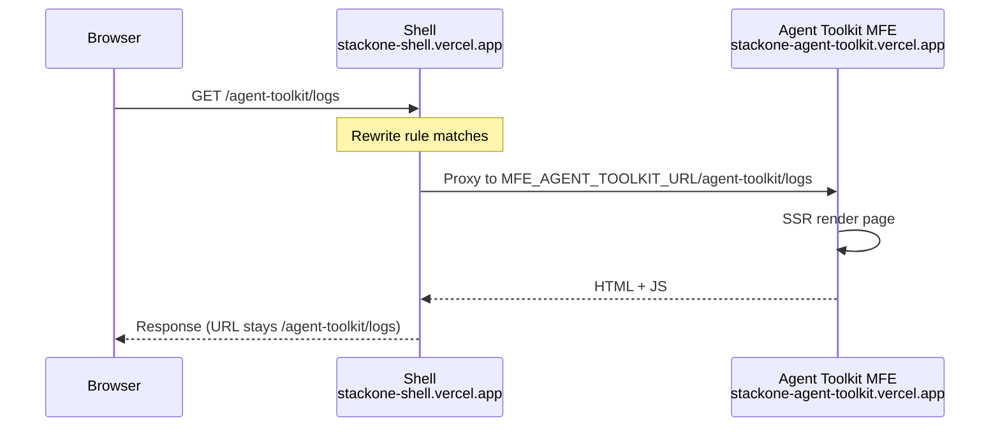
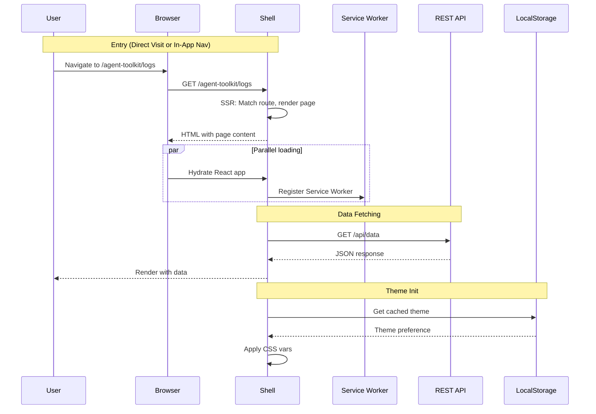
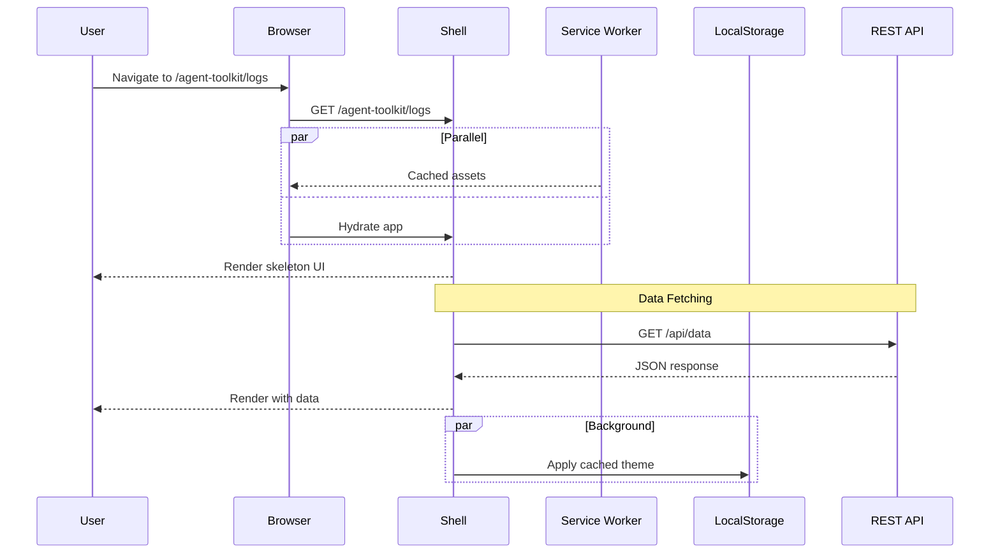
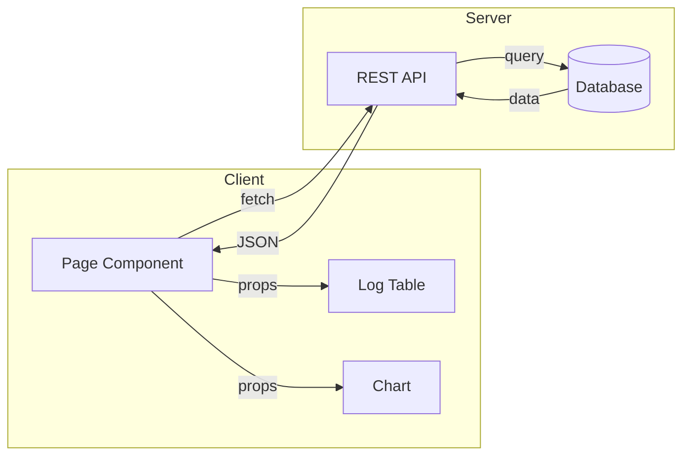
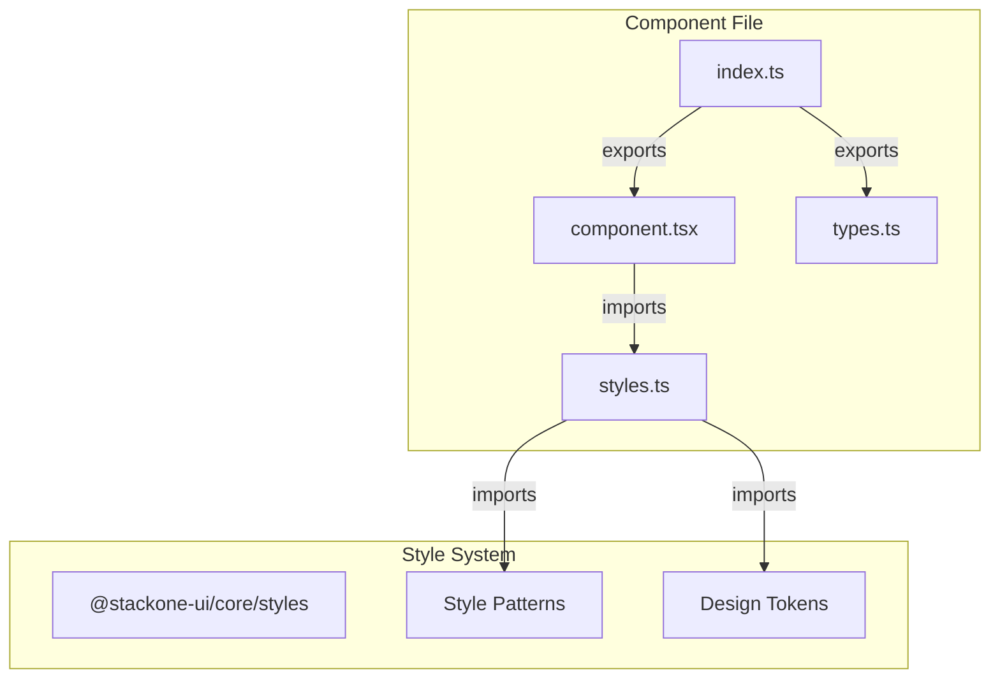
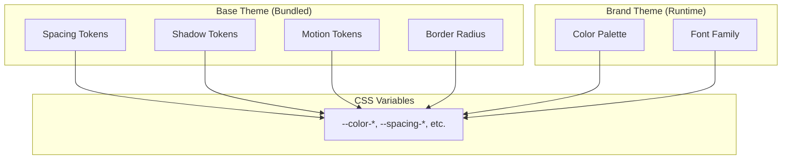

# Architecture

## Multi-Zone MFE Overview

The platform uses Next.js Multi-Zones with 4 separate Vercel deployments. Shell serves as the main entry point and proxies requests to MFEs via URL rewrites.

| App | Port (dev) | basePath | Vercel URL |
|-----|-----------|----------|------------|
| Shell | 3000 | none | `stackone-shell.vercel.app` |
| Agent Toolkit | 3001 | `/agent-toolkit` | `stackone-agent-toolkit.vercel.app` |
| Component Library | 3002 | `/component-library` | `stackone-component-library.vercel.app` |
| Design Review | 3003 | `/design-review` | `stackone-design-review.vercel.app` |



---

## Shell Rewrite Flow

When a user navigates to `/agent-toolkit/logs`:



**Rewrite rules** in `apps/shell/next.config.ts`:

```typescript
async rewrites() {
  return [
    { source: '/agent-toolkit', destination: `${MFE_AGENT_TOOLKIT_URL}/agent-toolkit` },
    { source: '/agent-toolkit/:path*', destination: `${MFE_AGENT_TOOLKIT_URL}/agent-toolkit/:path*` },
    // ... component-library, design-review
  ]
}
```

---

## Navigation Rules

| Navigation Type | Method | Example |
|-----------------|--------|---------|
| Shell → MFE | `<a>` tag | `<a href={Routes.agentToolkit}>Agent Toolkit</a>` |
| MFE → Shell | `<a>` tag | `<a href={Routes.shell.home}>Home</a>` |
| Within MFE | `<Link>` or `redirect()` | `<Link href={Routes.logs.index}>Logs</Link>` |

Cross-zone navigation requires full page loads. Within-zone uses client-side routing.

**Route configuration:**
- Shell: `apps/shell/src/lib/routes.ts`
- MFEs: `apps/mfe/*/src/routes.ts`

---

## Runtime Flows

### First Visit Sequence



---

### Return Visit Sequence



---

## Data Flow

### REST-First Pattern



---

## Component Architecture

### Zero-Inline-Classnames Pattern



---

## Two-Tier Theme System



See [Theming](theming.md) for details on the theme initialization flow.
