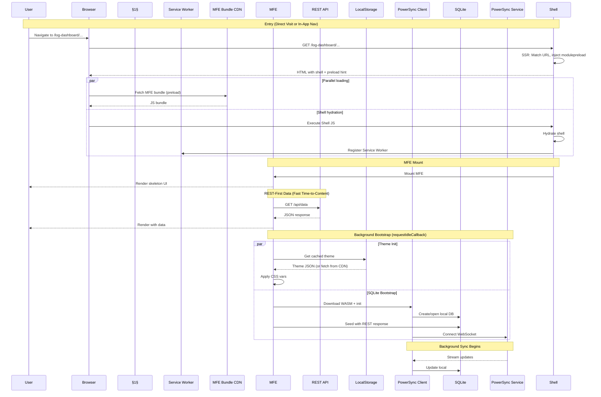
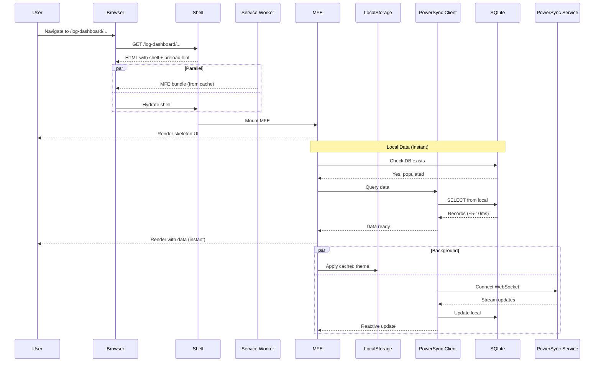

# Architecture

## Runtime

### First Visit Sequence

```mermaid
sequenceDiagram
    participant User
    participant Browser
    participant §1§
    participant SW as Service Worker
    participant Bundle as MFE Bundle CDN
    participant MFE
    participant API as REST API
    participant LS as LocalStorage
    participant PS as PowerSync Client
    participant SQL as SQLite
    participant PSS as PowerSync Service

    Note over User,Shell: Entry (Direct Visit or In-App Nav)
    User->>Browser: Navigate to /log-dashboard/...
    Browser->>Shell: GET /log-dashboard/...
    Shell->>Shell: SSR: Match URL, inject modulepreload
    Shell-->>Browser: HTML with shell + preload hint

    par Parallel loading
        Browser->>Bundle: Fetch MFE bundle (preload)
        Bundle-->>Browser: JS bundle
    and Shell hydration
        Browser->>Shell: Execute Shell JS
        Shell->>Shell: Hydrate shell
        Shell->>SW: Register Service Worker
    end

    Note over Shell,MFE: MFE Mount
    Shell->>MFE: Mount MFE
    MFE-->>User: Render skeleton UI

    Note over MFE,API: REST-First Data (Fast Time-to-Content)
    MFE->>API: GET /api/data
    API-->>MFE: JSON response
    MFE-->>User: Render with data

    Note over MFE,PSS: Background Bootstrap (requestIdleCallback)
    par Theme Init
        MFE->>LS: Get cached theme
        LS-->>MFE: Theme JSON (or fetch from CDN)
        MFE->>MFE: Apply CSS vars
    and SQLite Bootstrap
        MFE->>PS: Download WASM + init
        PS->>SQL: Create/open local DB
        MFE->>SQL: Seed with REST response
        PS->>PSS: Connect WebSocket
    end

    Note over PS,PSS: Background Sync Begins
    PSS-->>PS: Stream updates
    PS->>SQL: Update local
```

---

### Return Visit Sequence

```mermaid
sequenceDiagram
    participant User
    participant Browser
    participant Shell
    participant SW as Service Worker
    participant MFE
    participant LS as LocalStorage
    participant PS as PowerSync Client
    participant SQL as SQLite
    participant PSS as PowerSync Service

    User->>Browser: Navigate to /log-dashboard/...
    Browser->>Shell: GET /log-dashboard/...
    Shell-->>Browser: HTML with shell + preload hint

    par Parallel
        SW-->>Browser: MFE bundle (from cache)
    and
        Browser->>Shell: Hydrate shell
    end

    Shell->>MFE: Mount MFE
    MFE-->>User: Render skeleton UI

    Note over MFE,SQL: Local Data (Instant)
    MFE->>SQL: Check DB exists
    SQL-->>MFE: Yes, populated
    MFE->>PS: Query data
    PS->>SQL: SELECT from local
    SQL-->>PS: Records (~5-10ms)
    PS-->>MFE: Data ready
    MFE-->>User: Render with data (instant)

    par Background
        MFE->>LS: Apply cached theme
    and
        PS->>PSS: Connect WebSocket
        PSS-->>PS: Stream updates
        PS->>SQL: Update local
        PS-->>MFE: Reactive update
    end
```

---
