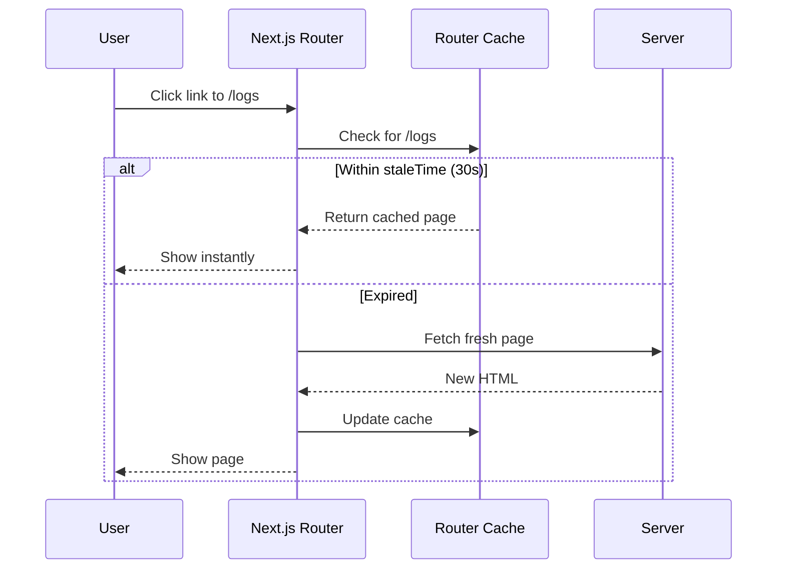
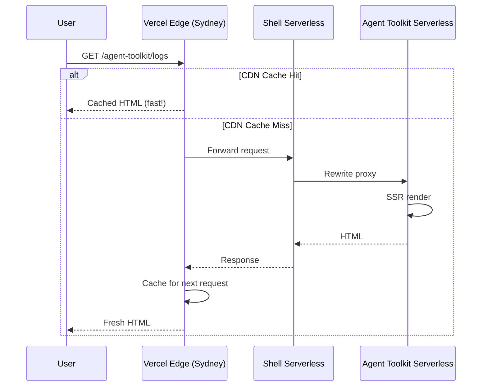
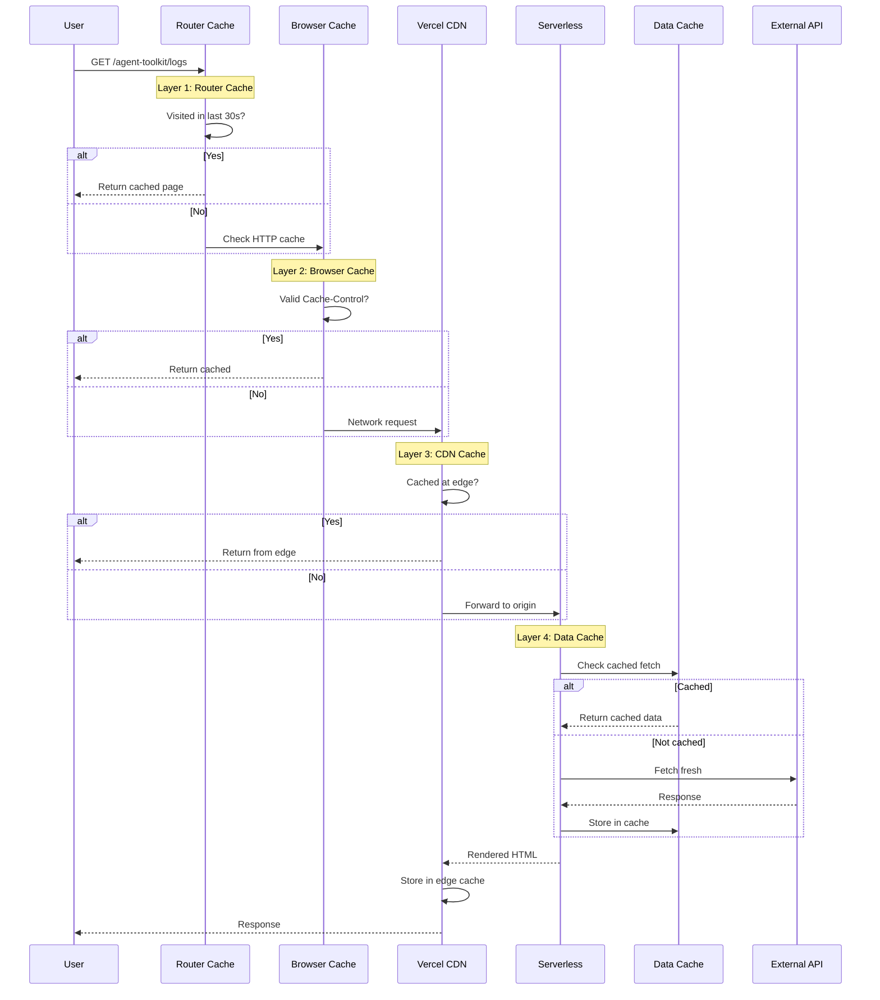

# Caching

Complete guide to caching in the StackOne platform — from browser to server.

## What is Caching?

**Caching = storing copies of data closer to where it's needed.**

Think of it like a coffee shop:
- **No cache**: Every order, the barista grinds beans, heats water, makes coffee (slow)
- **With cache**: Pre-made coffee sits ready, barista just pours (fast)

In web apps, caching stores copies of files, pages, and data so users don't wait for the server every time.

---

## Caching Strategies Explained

Before diving into layers, understand the four main strategies:

### 1. Cache-First (Offline-First)

```
Request → Check Cache → [HIT] → Return cached
                      → [MISS] → Fetch from network → Cache it → Return
```

**Best for**: Assets that rarely change (JS, CSS, images, fonts)

**Real-world analogy**: A librarian who checks the shelf first. Only orders a new book if it's not already there.

**Pros**:
- Instant responses for cached content
- Works offline
- Reduces server load

**Cons**:
- May serve stale content
- Need strategy to invalidate old cache

### 2. Network-First (Freshness-First)

```
Request → Try Network → [SUCCESS] → Cache it → Return
                      → [FAIL] → Check Cache → Return cached (fallback)
```

**Best for**: Content that changes frequently but should work offline (news feeds, social posts)

**Real-world analogy**: Checking your email online first, but reading cached emails if WiFi is down.

**Pros**:
- Always tries for fresh content
- Graceful offline fallback

**Cons**:
- Slower than cache-first
- Network latency on every request

### 3. Stale-While-Revalidate (SWR)

```
Request → Return cached immediately → Fetch fresh in background → Update cache
```

**Best for**: Content where speed matters more than immediate freshness (dashboards, analytics)

**Real-world analogy**: A newspaper showing yesterday's headlines while printing today's edition.

**Pros**:
- Instant response (always)
- Eventually consistent
- Best perceived performance

**Cons**:
- User may see stale data briefly
- More complex to implement

### 4. Network-Only

```
Request → Always fetch from network → Return (never cache)
```

**Best for**: Sensitive data, real-time requirements (banking, live scores)

**Real-world analogy**: Always calling the bank instead of trusting a written balance.

**Pros**:
- Always fresh
- No stale data risk

**Cons**:
- No offline support
- Higher latency
- More server load

---

## Why Our Approach (and Is It Right?)

### Our Current Strategy Mix

| Layer | Strategy | Why This Choice |
|-------|----------|-----------------|
| Router Cache | **Stale-While-Revalidate** | Fast navigation, eventual consistency acceptable |
| Browser Cache | **Cache-Control headers** | Let browser handle based on content type |
| CDN Cache | **ISR (Stale-While-Revalidate)** | Edge performance, background regeneration |
| Data Cache | **Network-Only** (currently) | Not implemented yet |

### Is This the Right Approach?

**Yes, for these reasons:**

1. **Browser Cache for Assets is Correct**

   Next.js generates hashed filenames (`chunk-abc123.js`) served with `Cache-Control: public, max-age=31536000, immutable`. The browser caches these for 1 year without revalidation.

   ```
   v1: /_next/static/chunks/main-abc123.js  ← cached forever
   v2: /_next/static/chunks/main-def456.js  ← new URL, fresh fetch
   ```

2. **Stale-While-Revalidate for Pages is Correct**

   Users get instant navigation. If data changed, they see it on next visit. For a log dashboard, 30-second staleness is acceptable.

   **Alternative**: Network-first would be correct for real-time trading apps, but adds latency.

3. **ISR for CDN is Correct**

   Static pages served from edge with background regeneration. Perfect for content that changes occasionally (home page, marketing pages).

   **When to change**: If you need real-time data on page load, use `dynamic = 'force-dynamic'`.

### When to Reconsider

| Scenario | Current | Should Change To |
|----------|---------|------------------|
| Real-time stock prices | Cache-First | Network-Only or WebSockets |
| User-specific dashboard | ISR | `dynamic = 'force-dynamic'` |
| E-commerce cart | Router Cache | Disable staleTimes for that route |
| Banking transactions | Any cache | Network-Only, no caching |

### Trade-offs We Accepted

| Trade-off | What We Chose | What We Gave Up |
|-----------|---------------|-----------------|
| Speed vs Freshness | Speed (browser cache) | Immediate data updates |
| Simplicity vs Control | Simplicity (Vercel defaults) | Fine-grained cache headers |

---

## The 4 Layers of Caching

When a user visits your app, their request passes through multiple caching layers:

```
┌─────────────────────────────────────────────────────────────────────┐
│                         USER'S BROWSER                               │
├─────────────────────────────────────────────────────────────────────┤
│  Layer 1: CLIENT ROUTER CACHE (staleTimes)                          │
│  ├─ Recently visited pages                                          │
│  ├─ Strategy: Stale-While-Revalidate                                │
│  └─ Stored in: JavaScript memory                                    │
├─────────────────────────────────────────────────────────────────────┤
│  Layer 2: BROWSER HTTP CACHE                                        │
│  ├─ Responses with Cache-Control headers                            │
│  ├─ Strategy: Varies by header                                      │
│  └─ Stored in: Browser disk cache                                   │
└─────────────────────────────────────────────────────────────────────┘
                              ↓ Network Request
┌─────────────────────────────────────────────────────────────────────┐
│                         VERCEL EDGE (CDN)                           │
├─────────────────────────────────────────────────────────────────────┤
│  Layer 3: CDN CACHE                                                 │
│  ├─ Static assets (1 year)                                          │
│  ├─ ISR pages (configurable)                                        │
│  ├─ Strategy: Cache-First + Stale-While-Revalidate                  │
│  └─ Stored in: Edge servers worldwide                               │
└─────────────────────────────────────────────────────────────────────┘
                              ↓ Cache Miss
┌─────────────────────────────────────────────────────────────────────┐
│                         VERCEL SERVERLESS                           │
├─────────────────────────────────────────────────────────────────────┤
│  Layer 4: DATA CACHE (fetch)                                        │
│  ├─ API responses with revalidate                                   │
│  ├─ Strategy: Configurable per fetch                                │
│  └─ Stored in: Vercel's data cache                                  │
└─────────────────────────────────────────────────────────────────────┘
```

---

## Layer 1: Client Router Cache (staleTimes)

### What It Is

Next.js keeps recently visited pages in memory. When you navigate back, it shows the cached version instantly instead of fetching again.

**Real-world analogy**: Browser tabs. If you switch between tabs, the content is already there — you don't reload each time.

### How It Works



### Configuration

**MFEs** (`apps/mfe/*/next.config.ts`):
```typescript
experimental: {
  staleTimes: {
    dynamic: 30,   // Dynamic pages: 30 seconds
    static: 180,   // Static pages: 3 minutes
  },
}
```

### What "Dynamic" vs "Static" Means

| Type | Example | staleTimes | Detected By |
|------|---------|------------|-------------|
| **Static** | Home page, about page | `180s` (3 min) | No dynamic functions |
| **Dynamic** | Logs with filters, search results | `30s` | Uses `cookies()`, `headers()`, `searchParams` |

### Web Vitals Impact

| Metric | Impact | How |
|--------|--------|-----|
| **INP** (Interaction to Next Paint) | Faster | Navigation feels instant |
| **CLS** (Cumulative Layout Shift) | Lower | No loading skeleton flash |

---

## Layer 2: Browser HTTP Cache

### What It Is

The browser's built-in cache that respects `Cache-Control` headers from the server.

**Real-world analogy**: Expiration dates on food. The header tells the browser "this is good until X date, don't ask again until then."

### How Headers Work

```
Server response:
Cache-Control: public, max-age=31536000, immutable

Browser interpretation:
- public: Anyone can cache this (CDN, browser)
- max-age=31536000: Valid for 1 year (31536000 seconds)
- immutable: Will NEVER change, don't even check
```

### Common Header Patterns

| Header | Meaning | Use Case |
|--------|---------|----------|
| `public, max-age=31536000, immutable` | Cache forever, never revalidate | Hashed static assets |
| `public, max-age=0, must-revalidate` | Always check with server | Dynamic HTML |
| `private, no-cache, no-store` | Never cache | Sensitive data |
| `public, s-maxage=60, stale-while-revalidate=300` | CDN caches 60s, serves stale for 5min | ISR pages |

### What Vercel Sets Automatically

| Resource | Cache-Control | Duration |
|----------|---------------|----------|
| `/_next/static/*` | `public, max-age=31536000, immutable` | 1 year |
| Static pages | `public, s-maxage=31536000` | 1 year |
| Dynamic pages | `private, no-cache, no-store` | 0 (no cache) |

---

## Layer 3: Vercel CDN (Edge Cache)

### What It Is

Vercel has servers worldwide (edge network). When someone in Tokyo requests your page, it's served from a Tokyo server, not your US origin.

**Real-world analogy**: Amazon warehouses. Instead of shipping from one central location, packages come from the nearest warehouse.

### How It Fits in Multi-Zone Architecture



### ISR (Incremental Static Regeneration)

ISR lets you cache pages at the edge but refresh them periodically:

```typescript
// Page is cached, regenerated every 60 seconds
export const revalidate = 60
```

**Timeline**:
```
0s    → User A requests page → Server renders → CDN caches
30s   → User B requests page → CDN serves cached (instant)
60s   → Cache expires
61s   → User C requests page → CDN serves stale, triggers revalidate in background
62s   → User D requests page → CDN serves fresh content
```

### Web Vitals Impact

| Metric | Impact | How |
|--------|--------|-----|
| **TTFB** (Time to First Byte) | Much faster | Response from nearby edge |
| **LCP** | Faster | HTML arrives sooner |

---

## Layer 4: Data Cache (fetch)

### What It Is

When your server fetches data from APIs, Next.js can cache those responses.

**Real-world analogy**: A restaurant prep cook. Instead of making sauce from scratch for each order, they prep a batch that's used all day.

### How fetch() Caching Works

```typescript
// No cache - always fresh (default in Next.js 15)
const data = await fetch('/api/logs')

// Cache forever until redeployed
const data = await fetch('/api/logs', { cache: 'force-cache' })

// Cache for 60 seconds
const data = await fetch('/api/logs', { next: { revalidate: 60 } })

// Cache with tags for selective invalidation
const data = await fetch('/api/logs', { next: { tags: ['logs'] } })
```

### Cache Tags for Smart Invalidation

Instead of clearing everything, invalidate only what changed:

```typescript
// Fetching with tag
const logs = await fetch('/api/logs', { next: { tags: ['logs'] } })

// Later, when logs change:
import { revalidateTag } from 'next/cache'
revalidateTag('logs')  // Only clears 'logs' tagged data
```

---

## Complete Request Flow

Here's how all layers work together:



---

## Web Vitals & Caching

### How Caching Affects Each Metric

| Metric | Target | Caching Solution |
|--------|--------|------------------|
| **LCP** < 2.5s | Largest element loads fast | CDN caching + ISR |
| **FCP** < 1.8s | First content appears | Browser cache for CSS |
| **TTI** < 3.8s | Page becomes interactive | Browser cache for JS |
| **TBT** < 200ms | Main thread not blocked | Code splitting + lazy load |
| **CLS** < 0.1 | No layout shifts | Router cache (no flash) |
| **INP** < 200ms | Interactions feel instant | Router cache for nav |

### Performance Targets

```
First Load JS shared by all: 102 KB
├─ React 19 + React DOM:     ~45 KB (required)
├─ Next.js 15 framework:     ~55 KB (required)
├─ App code + utilities:     ~2 KB
└─ Page-specific code:       144-163 bytes each

Lighthouse Targets:
├─ Performance:    90+
├─ LCP:            < 2.5s
├─ TBT:            < 200ms
└─ CLS:            < 0.1
```

---

## Current Configuration

### staleTimes

| App | Dynamic | Static | File |
|-----|---------|--------|------|
| Shell | 30s | 180s | `apps/shell/next.config.ts` |
| Agent Toolkit | 30s | 180s | `apps/mfe/agent-toolkit/next.config.ts` |
| Component Library | 30s | 180s | `apps/mfe/component-library/next.config.ts` |
| Design Review | 30s | 180s | `apps/mfe/design-review/next.config.ts` |

### ISR (revalidate)

| Page | revalidate | Reason |
|------|------------|--------|
| Shell home | 3600 (1 hour) | Translations rarely change |
| Component library | 3600 (1 hour) | Static content |
| Logs page | Not set | Uses mock data (dynamic) |

### fetch() Caching

Available cache tags (from `@stackone/utils`):

```typescript
import { CacheTags } from '@stackone/utils'

CacheTags.logs              // 'logs'
CacheTags.logDetail(id)     // 'log-{id}'
CacheTags.translations      // 'translations'
```

---

## Debug Tools

### Check Router Cache

React DevTools → Components → Search for "Router" → Check state

### Check CDN Cache Status

Look for response headers:
- `x-vercel-cache: HIT` = Served from CDN
- `x-vercel-cache: MISS` = Fetched from serverless
- `x-vercel-cache: STALE` = Served stale, revalidating

### Check Data Cache

```bash
# In build output, look for:
○ (Static)   - prerendered as static content
● (SSG)      - prerendered with getStaticProps
λ (Server)   - server-side renders at runtime
```

---

## Summary

| Layer | What's Cached | Strategy | Duration | Location |
|-------|---------------|----------|----------|----------|
| **1. Router Cache** | Visited pages | Stale-While-Revalidate | 30s dynamic, 180s static | Browser memory |
| **2. Browser Cache** | HTTP responses | Per Cache-Control | Per header | Browser disk |
| **3. CDN Cache** | Static assets, ISR pages | Cache-First + SWR | 1 year / revalidate | Vercel Edge |
| **4. Data Cache** | fetch() responses | Configurable | Per revalidate | Vercel serverless |
